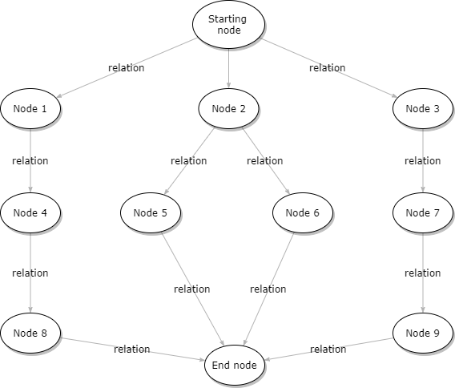

# ss-for-news

About SoftSpiders - For Jepria News

## FS-граф

FeatureSet-граф
TBD

## Словарь используемых тегов

Ниже приведён перечень тегов, на данный момент используемых в SoftSpiders.
Он в полной мере отражают направления интересов, ...  

- api
- apollo
- auth
- backend
- create-react-app
- db
- e2e
- express
- gatsby
- google
- graph
- hapi
- headless
- helloworld
- heroku
- java
- javascript
- jersey
- jest
- junit
- lerna
- maven
- micro
- module
- mongodb
- mongoose
- monorepo
- nextjs
- nodejs
- now
- oauth
- passport
- puppeteer
- reach-router
- react
- rest
- server
- serverless
- storybook
- tdd
- todo
- test
- travis
- typescript
- snapshot
- web
- zeit

Нужна система навигации по fs-графу 