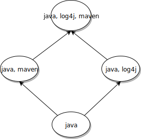

# *[Проект SoftSpiders](https://github.com/softspider)*

  

*[SoftSpiders](https://github.com/softspider)* создаётся разработчиками для разработчиков.

Главная цель проекта состоит в облегчении труда разработчиков программ путём
создания сервиса, который позволит максимально быстро и удобно находить и создавать качественные прототипы в любых
видах программной разработки.

В основе этого сервиса база знаний программных решений, организованная в виде иерархии **минималистичных** шаблонных проектов.

Предполагается, что развитие этой базы знаний должно происходить постоянно и неограниченно.

Из остальных задач, которые решает *SoftSpiders*, можно выделить, как минимум, следующие:

- создание базы знаний программных решений с удобным поиском и навигацией
- использование шаблонных проектов в качестве основы для разработки
- обмен опытом с другими разработчиками
    - самообучение - путём изучения программных решений, опубликованных на *SoftSpiders*
    - фиксация результатов самообучения или разработки в виде новых проектов-шаблонов
    - обучение других разработчиков
- "And last but not least" - участие в *SoftSpiders* - один из самых лёгких способов приобретения репутации участника
OpenSource-проектов. Живой пример: участники *SoftSpiders* получали бесплатные лицензии на использование весьма недешёвых
программных продуктов. 

# Главная идея

Освоение чего-то нового почти всегда начинается с написания hello-world программы.
TBD 

# Иерархия проектов

## Принципы организации иерархии

Иерархия проектов *SoftSpiders* организована примерно так же, как иерархия классов в ООП, поддерживающая множественное
наследование.

### *Свойства* и *теги*

Ключевым понятием организации иерархии является понятие *свойства*.

Каждое *свойство*  определяет некоторую функциональность, которая может быть поддержана в проекте - то, для чего на
английском обычно используется термин *feature*.

В *SoftSpiders* поддерживается расширяемый стандартизованный перечень свойств.
Каждому свойству ставится в соответствие уникальный *тег* (или - в более общем случае - уникальный набор равноправных
тегов-синонимов).
В контексте *SoftSpiders* понятия *тег* и *свойство* являются взаимозаменяемыми. 

Каждый проект-шаблон *SoftSpiders* имеет какой-то определённый набор свойств и помечается соответствующим набором тегов.

Например, если проект **A** представлен программой на Java, то он помечается тегом *java* (набором тегов *{java}*).

Проект **B** является потомком проекта **A**, если свойства проекта **B** включают в себя все свойства проекта **A**.
Поскольку не все наборы свойств могут быть сравнимы между собой, то проекты образуют
[*частично-упорядоченное множество*](https://ru.wikipedia.org/wiki/%D0%A7%D0%B0%D1%81%D1%82%D0%B8%D1%87%D0%BD%D0%BE_%D1%83%D0%BF%D0%BE%D1%80%D1%8F%D0%B4%D0%BE%D1%87%D0%B5%D0%BD%D0%BD%D0%BE%D0%B5_%D0%BC%D0%BD%D0%BE%D0%B6%D0%B5%D1%81%D1%82%D0%B2%D0%BE),
или [DAG](https://ru.wikipedia.org/wiki/%D0%9E%D1%80%D0%B8%D0%B5%D0%BD%D1%82%D0%B8%D1%80%D0%BE%D0%B2%D0%B0%D0%BD%D0%BD%D1%8B%D0%B9_%D0%B0%D1%86%D0%B8%D0%BA%D0%BB%D0%B8%D1%87%D0%B5%D1%81%D0%BA%D0%B8%D0%B9_%D0%B3%D1%80%D0%B0%D1%84)-иерархию.

### Пример

А если проект **B** расширяет функциональность родительского проекта **A**, например, использованием логирования
посредством *log4j*, то он помечается набором тегов *{java, log4j}*.

## Текущая реализация иерархии проектов

Иерархия проектов реализуется посредством http-ссылок, размещающихся в файле README.md каждого
проекта. 

# FAQ

## Какие проблемы решает *SoftSpiders* ?

TBD

## Зачем нужны шаблонные проекты ?

Разработку любого проекта намного проще начать, если взять за основу близкий по функциональности другой уже работающий
проект. Шаблонные проекты *SoftSpiders* как раз и являются такими работающими проектами.

## Зачем нужна минималистичность ?

Ортогональность
Каждое свойство - измерение
Набор свойств - базис
Каждый проект - вектор
Каждый новый потомок в идеале новый helloworld...
Наиболее дешёвый способ развития базы знаний 

## Как создать новый проект-шаблон ?

## Как создавать новые теги свойств ?

## Возможна ли публикация сложных потомков ?

## Авторство... ?

## Какие технологии охватываются проектом *SoftSpiders* ?

## Что можно будет считать успешным завершением проекта *SoftSpiders* ?

Концептуально проект *SoftSpiders* несёт идею базы данных программных решений, которая бескончено развивается во времени и
цифровом пространстве. Как таковой, проект не предполагает какого-либо завершения. Или, если сказать по-другому, никакое
завершение проекта не будет считаться успешным. 
Но, с другой стороны, очевидно, что по мере своего роста проект должен совершенствоваться, масштабироваться и,
соответственно, менять способ своей реализации.  

## На каких технологиях реализован проект ?

В данный момент *SoftSpiders* реализован как система git-репозиториев, размещаемых на *GitHub*. Каждый репозиторий
содержит ровно один проект.

## Что нужно проекту прямо сейчас ?

- Разработка манифеста проекта (изложение концепции, в первую очередь - на английском языке) 
- Разработка манифеста проекта 
- Разработка правил работы с тегами, в том числе:
    - разработка правил стандартизации тегов
    - поддержка тегов-синонимов
    - разработка правил поддержки зависимых тегов (например, чтобы присутствие тега *log4j* автоматически означало
    присутствие тега *java*)

Только после разработки и формулировки внятных правил (на русском и английском языках) можно будет выходить на широкую
аудиторию для привлечения участников. 

## Что потребуется в ближайшее время ?

- Разметка уже существующих репозиториев соответствующими тегами
- Разработка json-представления для проектов-шаблонов
- Система навигации по иерархии проектов-шаблонов
- Система мотивации участников (геймификация, рейтинги, ...)

## Что будет нужно всегда ?

- Наполнение базы знаний её главным содержанием - проектами-шаблонами

## ...

## FS-граф

Feature-Set-граф
TBD

## Словарь используемых тегов

Ниже приведён перечень тегов, на данный момент зарезервированных и используемых в SoftSpiders. В скобках указаны
теги-синонимы (также зарезервированные).

- api
- apollo
- auth
- backend
- cd
- ci
- clean-architecture (ca)
- create-react-app (cra)
- database (db)
- e2e
- express
- gatsby
- google
- gradle
- graphql
- hapi
- headless
- heroku
- java
- javascript (js)
- jersey
- jest
- junit
- lerna
- log4j
- maven
- micro
- module
- mongodb
- mongoose
- monorepo
- nextjs (next)
- nodejs (node)
- now
- oauth
- passport
- puppeteer
- reach-router
- react
- react-native (rn)
- rest
- server
- serverless
- storybook
- tdd
- todo
- testing (test)
- travis
- typescript (ts)
- snapshot
- web
- zeit

# Текущее состояние

Фактом этой публикации проект приобретает статус локального MVP, поскольку уже выносится на ваш суд - суд пользователей, хотя пока
только и потенциальных.

# Дорожная карта (roadmap)
