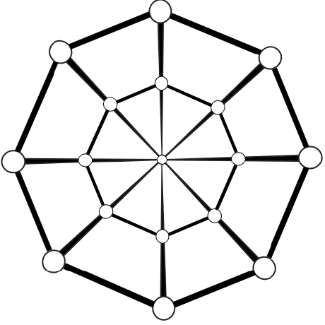

# Проект  *SoftSpiders*

*[SoftSpiders](https://github.com/softspider)* - база знаний программных решений, организованная в виде иерархии
**минималистичных** шаблонных проектов.

# Задачи проекта

Из задач, которые решает SoftSpiders, можно выделить, как минимум, следующие:

- создание базы знаний программных решений с удобным поиском и навигацией
- использование проектов SoftSpiders в качестве основы для разработки
- обмен опытом с другими разработчиками
    - самообучение - изучение программных решений, опубликованных на *SoftSpiders*
    - фиксация результатов самообучения или разработки в виде новых проектов-шаблонов
    - обучение других разработчиков
- создание portfolio - лёгкий способ
- "And last but not least" - лёгкий способ приобретения репутации участника в OpenSource-проектах.
Живой пример: участники SoftSpiders получали бесплатные лицензии на использование продуктов JetBrains. 

# FAQ

## Зачем нужны шаблонные проекты ?

Разработку любого проекта намного проще начать, когда вместо того, чтобы строить его с нуля, за основу берётся другой
заведомо работоспособный проект. Шаблонные проекты SoftSpiders как раз являются такими заведомо работоспособными проектами.

## Зачем нужна минималистичность ?

Ортогональность
Каждое свойство - измерение
Набор свойств - базис
Каждый проект - вектор
Каждый новый потомок в идеале новый helloworld...
Наиболее дешёвый способ развития базы знаний 

## ...

# Реализация на GitHub

В данный момент *SoftSpiders* реализован как система git-репозиториев, размещаемых на *GitHub*. Каждый репозиторий
содержит ровно один проект.

# Иерархия проектов

## Принципы организации иерархии

Принцип организации иерархии похож на принципы организации множественного наследования в ООП.

Проект **B** является потомком проекта **A**, если свойства проекта **B** включают в себя все свойства проекта **A**.
Поскольку не все наборы свойств могут быть сравнимы между собой, то проекты образуют частично-упорядоченную систему,
или DAG(Directed Acyclic Graph)-иерархию.

Каждое *свойство* (feature, функция, возможность) проекта  определяет некоторую функциональность, которая может быть
поддержана проектом независимо от других его свойств. Каждому свойству ставится в соответствие уникальный *тег*.
*SoftSpiders* имеет расширяемый стандартизованный перечень таких тегов.  
Например, если проект **A** представлен минималистичной программой на Java, то он помечается тегом *java* (набором
тегов {*java*}).

А если проект **B** расширяет функциональность родительского проекта **A**, например, использованием логирования, то он
помечается набором тегов {*java, log*}.

## Текущая реализация иерархии проектов

Иерархия проектов реализуется посредством http-ссылок, размещающихся в файле README.md каждого
проекта. 

## FS-граф

Feature-Set-граф
TBD

## Словарь используемых тегов

Ниже приведён перечень тегов, на данный момент используемых в SoftSpiders.
Он в полной мере отражают направления интересов, ...  

- api
- apollo
- auth
- backend
- clean-architecture (ca)
- create-react-app
- db
- e2e
- express
- gatsby
- google
- graph
- hapi
- headless
- helloworld (hw)
- heroku
- java
- javascript (js)
- jersey
- jest
- junit
- lerna
- maven
- micro
- module
- mongodb
- mongoose
- monorepo
- nextjs
- nodejs
- now
- oauth
- passport
- puppeteer
- reach-router
- react
- rest
- server
- serverless
- storybook
- tdd
- todo
- test
- travis
- typescript (ts)
- snapshot
- web
- zeit

# Текущее состояние

Фактом этой публикации проект приобретает статус MVP, поскольку уже выносится на ваш суд - суд пользователей, хотя пока
только и потенциальных.

# Дорожная карта (roadmap)

## Что нужно прямо сейчас

- Наполнение проекта содержанием - новыми проектами-шаблонами
- Публикация манифеста проекта 
- разметка репозиториев соответствующими тегами
- Система навигации по fs-графу.
- ...