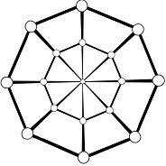

# Воинам Jepria о проекте *[SoftSpiders](https://github.com/softspider)*

  
  
  

Проект *[SoftSpiders](https://github.com/softspider)* неспешно разрабатывается с начала этого уже почти истёкшего года.

Главный текст проекта

[Текст](README.md)

Предполагается, что [текст](README.md) будет перенесён в документацию *SoftSpiders*, когда будут разработаны основные
правила развития проекта, когда текст будет доработан, получит свой окончательный вид и, как минимум, английский перевод.

По всем признакам при надлежащей организации проект может быть широко масштабирован. 

Обязательным условием массовой успешности проекта является широкое участие "контрибьютеров".
В данный момент проект пока не выносился "на суд широкой общественности" (вы - первые ;)), и с этой точки зрения
находится всё ещё в инкубационном периоде.

# Неограниченная масштабируемость во времени и цифровом пространстве 

*SoftSpiders* имеет две отличительные особенности, которые отчасти сознательно, отчасти бессознательно закладывались в его
идеологию: постоянное развитие, не требующее суеты и авралов, и неограниченный, в хорошем смысле слова экстенсивный рост
в любом технологическом направлении. 

## Постоянное развитие 

Проект предполагает своё постоянное развитие во всех нынешних и будущих программных технологиях.
Как подтверждается уже почти годовой личной практикой, особенность *SoftSpiders* в том, что он не требует от участников
какого-либо форсирования усилий. В любой момент можно начать в нём участвовать, в любой момент можно это участие
прервать, и в любой момент его можно возобновить. 

## Экстенсивный рост 

TBD
 
# "Встать у истоков" 

Сегодня у каждого есть прекрасная возможность "встать у истоков" - участвовать не только в наполнении *SoftSpiders* его
главным содержанием - проектами-прототипами, но и внести свой вклад в разработку его стандартов и правил развития.

# Успех не обязательно должен быть массовым 

Но, как показал опыт моей работы за этот год даже без массового успеха проект будет продолжать свою жизнь хотя бы в том виде, какой он
имеет сейчас.
 
Сейчас иерархия проектов-шаблонов построена на иерархии GitHub-репозиториев, которая реализуется посредством http-ссылок,
размещающихся в файле README.md каждого проекта *SoftSpiders*. 

 